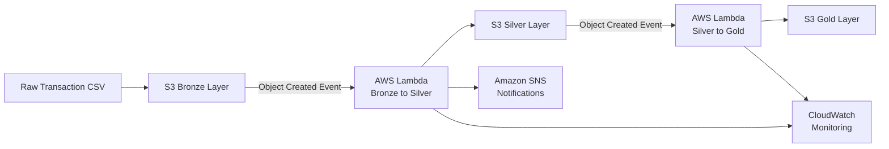

# AWS Medallion Data Pipeline

## Overview

This project demonstrates an AWS-based Medallion Architecture for processing transaction data through three layers:

**Bronze → Silver → Gold**

The pipeline uses Amazon S3 and AWS Lambda to automatically process and transform transaction data as it moves between the layers.

## Architecture

Data Flow

1. A raw transaction CSV file is uploaded to the S3 Bronze layer.
2. The S3 Object Created event triggers the Bronze-to-Silver Lambda.
3. The Lambda reads and cleans the raw transaction data.
4. Cleaned data is written to the S3 Silver layer.
5. Creation of the Silver CSV triggers the Silver-to-Gold Lambda.
6. The Lambda aggregates the cleaned data.
7. The final analytics-ready dataset is written to the S3 Gold layer.
8. CloudWatch is used for monitoring and Lambda logs.
9. Amazon SNS is used for notification capabilities.

Bronze Layer

The Bronze layer stores the raw transaction data received from the source.
S3 prefix:
bronze/
The Bronze layer preserves the source data before transformation.

Silver Layer

The Bronze-to-Silver Lambda processes the raw transaction data and creates a cleaned dataset.

Processing

* Data cleaning
* Duplicate removal
* Invalid/outlier record removal
* Transaction data transformation
* CSV processing
* Creation of a clean dataset

Output:
silver/clean_transactions.csv

Gold Layer

The Silver-to-Gold Lambda processes the cleaned Silver data and creates an analytics-ready aggregated dataset.

Processing

* Grouping transactions by product category
* Calculating transaction counts
* Calculating total transaction amounts
* Creating the final Gold dataset

Output:
gold/gold_transactions.csv

AWS Services Used

* Amazon S3
* AWS Lambda
* AWS IAM
* Amazon SNS
* Amazon CloudWatch

Lambda Functions

1. Bronze to Silver

File:
lambda/bronze-to-silver/lambda_function.py
The function is triggered when a CSV file is uploaded to the Bronze S3 prefix.

Responsibilities:

* Read the Bronze CSV file
* Clean transaction data
* Remove duplicate records
* Remove invalid/outlier records
* Write the cleaned dataset to the Silver layer

2. Silver to Gold
File:
lambda/silver-to-gold/lambda_function.py
The function is triggered when a CSV file is created in the Silver S3 prefix.

Responsibilities:

* Read the Silver dataset
* Aggregate transactions by category
* Calculate transaction counts
* Calculate total transaction amounts
* Write the Gold dataset to S3

S3 Event-Driven Processing

The pipeline uses S3 Object Created events to automatically trigger the Lambda functions.
Raw CSV
   |
   v
S3 Bronze
   |
   v
Bronze-to-Silver Lambda
   |
   v
S3 Silver
   |
   v
Silver-to-Gold Lambda
   |
   v
S3 Gold

IAM

AWS IAM roles are used to provide the Lambda functions with the required permissions.

The Lambda functions require permissions to:

* Read objects from S3
* Write transformed objects to S3
* Publish notifications where required

AWS access keys and secrets are not stored in this repository.

Monitoring and Notifications

Amazon CloudWatch can be used to monitor:

* Lambda execution
* Lambda logs
* Execution duration
* Memory usage
* Errors and failures

Amazon SNS is used for notification capabilities.
aws-medallion-pipeline/
│
├── lambda/
│   │
│   ├── bronze-to-silver/
│   │   └── lambda_function.py
│   │
│   └── silver-to-gold/
│       └── lambda_function.py
│
├── sample-data/
│   └── sample_transactions.csv
│
├── .gitignore
│
└── README.md

Sample Data

A small sample transaction dataset is included for demonstration purposes.
File:
sample-data/sample_transactions.csv
The large transaction datasets used during AWS testing are stored in Amazon S3 and are not uploaded to GitHub.

Technologies

* Python
* Amazon S3
* AWS Lambda
* AWS IAM
* Amazon SNS
* Amazon CloudWatch
* CSV Processing
* Event-Driven Architecture
* Medallion Architecture
* ETL

Key Learning Outcomes

This project demonstrates practical experience with:

* AWS S3 data lake architecture
* Medallion Architecture
* Serverless data processing
* Event-driven architecture
* Python-based ETL
* Data cleaning and transformation
* Data aggregation
* S3 event triggers
* IAM permissions
* CloudWatch monitoring
* SNS notifications

Project Outcome

The completed pipeline automatically transforms transaction data through:

Bronze → Silver → Gold

This demonstrates a practical serverless data engineering workflow using AWS services.
